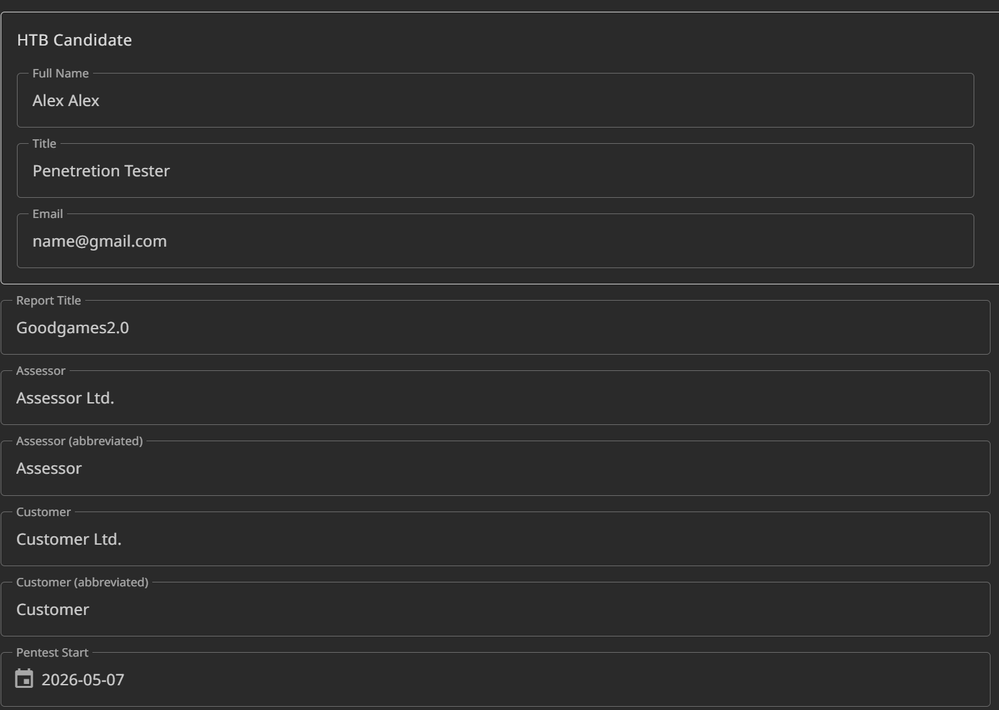
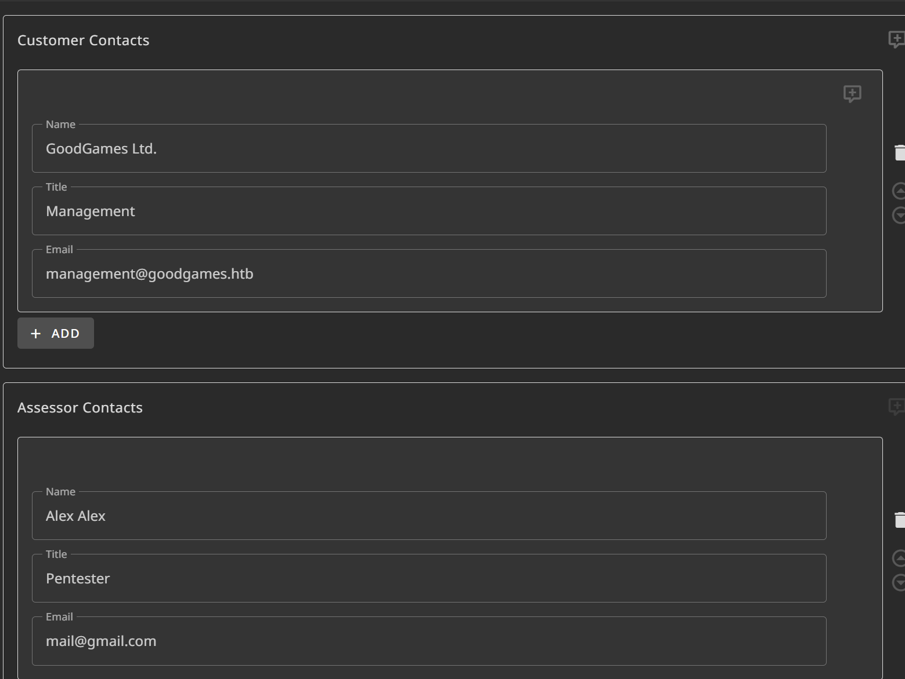
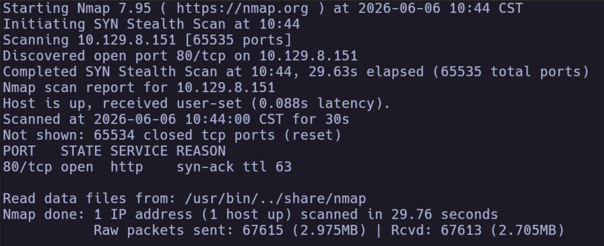
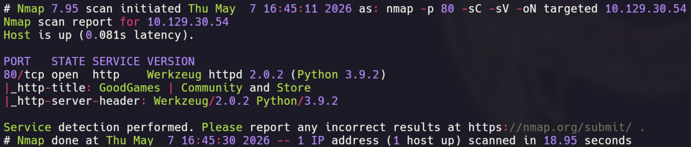
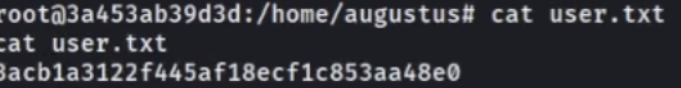
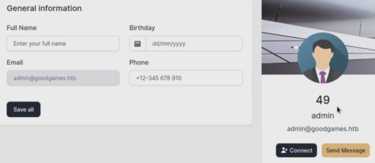

En este post quiero compartir un ejemplo práctico de cómo puede estructurarse un reporte con enfoque similar al utilizado en la certificación CJCA de Hack The Box.

Para este ejemplo se utilizará la máquina **GoodGames**, una máquina Easy de Hack The Box, como base para redactar un reporte de práctica. La idea no es resolver la máquina paso a paso, sino mostrar cómo convertir los hallazgos técnicos en un reporte claro, ordenado y útil.

> **Nota importante:**  
> Todo el contenido técnico utilizado en este ejemplo, incluyendo vectores de ataque, credenciales, vulnerabilidades, rutas, evidencias y recomendaciones, está basado únicamente en la máquina GoodGames de Hack The Box.  
>
> Este post **no contiene información del examen real de CJCA**, no revela escenarios, credenciales, infraestructura, flags, preguntas ni hallazgos pertenecientes a la certificación.  
>
> La plantilla y el estilo del reporte se usan únicamente con fines educativos para practicar documentación y redacción profesional.

---

## ¿Por qué usar GoodGames como ejemplo?

GoodGames es una buena máquina para practicar documentación porque permite construir una narrativa bastante completa de compromiso.

A lo largo del laboratorio se pueden identificar elementos importantes para un reporte, como enumeración inicial, análisis de una aplicación web, explotación de una vulnerabilidad, uso de credenciales descubiertas durante el proceso, acceso inicial, escalada de privilegios y evidencia técnica para respaldar cada hallazgo.

Esto la convierte en un buen escenario para practicar algo que muchas veces se deja de lado: **no basta con comprometer una máquina; también hay que saber explicar qué ocurrió, cómo ocurrió, cuál fue el impacto y cómo puede corregirse**.

---

## Enfoque del reporte

Para este ejemplo, el reporte se redactará como si GoodGames representara un entorno de una organización ficticia.

El objetivo no será simplemente decir “se encontró SQL Injection” o “se obtuvo root”, sino explicar el camino completo de ataque de una forma entendible:

- Qué servicio fue analizado.
- Qué debilidad fue identificada.
- Cómo se validó la vulnerabilidad.
- Qué acceso permitió obtener.
- Qué información sensible quedó expuesta.
- Cómo se escaló el impacto.
- Qué debería hacer la organización para corregir el problema.

Este enfoque ayuda a transformar una explotación técnica en un reporte profesional.

---

## Estructura para el reporte

La plantilla oficial de **SysReptor para CJCA** divide el reporte en varias secciones principales. Cada una cumple una función específica dentro del documento y ayuda a separar la información administrativa, el resumen ejecutivo, la fase ofensiva, la fase defensiva y los anexos.

En la plantilla se pueden observar las siguientes secciones:

- **Meta**
- **Document Control**
- **Executive Summary**
- **Assignment**
- **Phase 1: Grey Box Penetration Test**
- **Network Penetration Test Assessment Summary**
- **Internal Network Compromise Walkthrough**
- **Remediation Summary**
- **Phase 2: SIEM Alert Validation and Analysis**
- **Appendix**
- **Findings**


## Meta

La sección **Meta** contiene información general del reporte. Normalmente aquí se definen datos como el nombre del cliente, el nombre del candidato, el tipo de evaluación, fechas relevantes y otra información administrativa que la plantilla utiliza para completar automáticamente distintas partes del documento.

En un reporte real, esta sección no suele ser parte del contenido técnico principal, pero es importante porque permite mantener consistencia en todo el documento.



## Document Control

La sección **Document Control** sirve para llevar control sobre la versión del documento, autores, fechas de modificación y estado del reporte.

Esto es útil porque un reporte profesional puede pasar por varias revisiones antes de entregarse.



## Executive Summary

El **Executive Summary** es una de las secciones más importantes del reporte.

Aquí se resumen los resultados de la evaluación en un lenguaje claro y entendible para perfiles técnicos y no técnicos. No se trata de explicar comandos ni payloads, sino de comunicar el impacto general del compromiso.

## Assignment

La sección **Assignment** describe el contexto y objetivos de la evaluación.

## Phase 1: Grey Box Penetration Test

En la plantilla de CJCA, la primera fase corresponde a la parte ofensiva de la evaluación.

Aquí se documenta el proceso de enumeración, explotación, acceso inicial, post-explotación y escalada de privilegios.


## Network Penetration Test Assessment Summary

Esta sección resume los resultados principales de la fase ofensiva del reporte.

En la plantilla de CJCA, esta parte se utiliza para presentar una visión general de los hallazgos identificados durante la prueba de penetración. Normalmente incluye la cantidad total de vulnerabilidades encontradas, su severidad, una tabla con el nombre de cada hallazgo y un resumen de los hosts o usuarios comprometidos durante la evaluación.

En un reporte real, esta sección ayuda al lector a entender rápidamente qué tan grave fue el compromiso antes de entrar en el detalle técnico de cada vulnerabilidad.

Para este ejemplo, se utilizará la máquina **GoodGames** de Hack The Box como único objetivo evaluado. Por lo tanto, en lugar de listar múltiples hosts internos como ocurriría en un entorno empresarial o en un escenario completo de examen, el resumen se enfocará únicamente en los hallazgos identificados dentro de esta máquina de laboratorio.

Esta sección se divide en varias subsecciones, cada una enfocada en resumir un aspecto importante de la fase ofensiva.

---

### Summary of Findings

En esta subsección se debe colocar un resumen general de los hallazgos identificados durante la evaluación.

Aquí normalmente se indica cuántas vulnerabilidades fueron encontradas, cómo se distribuyen por severidad y cuáles son los nombres de los hallazgos principales. Su propósito es dar una vista rápida del nivel de riesgo identificado durante la prueba.

No se desarrolla todavía el detalle técnico de cada vulnerabilidad. Esa explicación corresponde a secciones posteriores del reporte. En esta parte solo se presenta una visión resumida y organizada de los hallazgos.

Ejemplo:

| # | Severity Level | Finding Name |
|---|---|---|
| 1 | High | SQL Injection in Login Form |

En este caso, el hallazgo resume una vulnerabilidad identificada en la aplicación web de GoodGames que permitió manipular consultas SQL desde el formulario de autenticación.

---

### Exploited Hosts

En esta subsección se deben listar los hosts que fueron comprometidos durante la evaluación.

Normalmente se incluye información como la dirección IP o nombre del host, si pertenece al alcance de la evaluación, el método utilizado para comprometerlo y una breve nota sobre el tipo de acceso obtenido.

El objetivo de esta parte es mostrar qué sistemas fueron afectados y cómo se relacionan con la cadena de ataque. En un entorno con varios hosts, esta subsección ayuda a entender el avance del compromiso dentro de la red.

Ejemplo:

| Host | Scope | Method | Notes |
|---|---|---|---|
| GoodGames | Internal | Web Application Exploitation | Initial access path identified through the vulnerable web application |

En este ejemplo, el host comprometido corresponde únicamente a la máquina GoodGames, ya que el reporte está basado en un laboratorio individual y no en una red interna con múltiples objetivos.

---

### Compromised Users

En esta subsección se deben documentar los usuarios comprometidos o utilizados durante la prueba.

Aquí se puede incluir el nombre del usuario, el host donde fue utilizado, el método mediante el cual se obtuvo acceso y una breve descripción del nivel de privilegio alcanzado.

Esta parte es útil para entender qué cuentas fueron afectadas, si existió reutilización de credenciales, si se obtuvo acceso a usuarios privilegiados o si alguna cuenta permitió continuar con la escalada del ataque.

Ejemplo:

| Username | Host | Method | Notes |
|---|---|---|---|
| Standard System User | GoodGames | Credential Reuse | Access obtained after credentials were discovered during the web application compromise |

En un reporte público o de práctica, es recomendable evitar colocar credenciales completas. Si se incluyen como evidencia, deberían censurarse parcialmente.

```text
Username: admin
Password: super****
```

---

### Changes / Host Cleanup

En esta subsección se deben documentar los cambios realizados sobre los sistemas durante la evaluación y las acciones de limpieza ejecutadas al finalizar la prueba.

En un reporte profesional, esta parte es importante porque permite dejar constancia de archivos creados, herramientas subidas, usuarios modificados, payloads ejecutados, configuraciones alteradas o cualquier otro cambio relevante realizado durante la prueba.

También debe indicarse si esos cambios fueron revertidos o si quedó alguna acción pendiente de limpieza. Su objetivo es mantener transparencia sobre el impacto operativo de la evaluación.

Ejemplo:

| Host | Scope | Change / Cleanup needed |
|:---|:---|:---|
| 172.19.0.1 (GoodGames Host) | Internal | Remove the test SUID binary located at `/home/augustus/bash_host`.

En el caso de una máquina de Hack The Box, la limpieza no tiene el mismo impacto que en un entorno real de producción. Sin embargo, incluir esta subsección ayuda a practicar una buena estructura de reporte profesional.

## Internal Network Compromise Walkthrough

Esta sección describe la ruta de compromiso seguida durante la fase ofensiva de la evaluación.

A diferencia del **Network Penetration Test Assessment Summary**, que presenta una vista resumida de los hallazgos, esta sección explica cómo se llegó desde la enumeración inicial hasta el compromiso del sistema.

En la plantilla de CJCA, esta parte suele dividirse en dos subsecciones principales:

- **Walkthrough Summary**
- **Detailed Walkthrough**
- **Collected Evidence**


La idea es construir una narrativa clara del ataque, mostrando cómo cada hallazgo permitió avanzar hacia el siguiente paso. No se trata únicamente de pegar comandos o capturas, sino de explicar el razonamiento detrás de cada acción y cómo se relaciona con el impacto final.

---

### Walkthrough Summary

Esta subsección presenta un resumen de alto nivel de la cadena de compromiso.

Aquí se debe explicar, de forma breve y ordenada, cuál fue el camino general seguido por el atacante. El objetivo es que el lector pueda entender la historia completa del compromiso sin entrar todavía en todos los detalles técnicos.

Normalmente, esta parte incluye:

- Punto de entrada inicial.
- Vulnerabilidad principal explotada.
- Información sensible obtenida.
- Método utilizado para obtener acceso inicial.
- Técnica usada para escalar privilegios.
- Resultado final del compromiso.

---

### Detailed Walkthrough

Esta subsección contiene el desarrollo técnico completo del compromiso.

Aquí sí se documenta el proceso paso a paso, incluyendo evidencia, comandos relevantes, capturas de pantalla y explicación de cada fase del ataque.

El objetivo es demostrar cómo se validó cada hallazgo y cómo se avanzó dentro del entorno.

| Step # | IP/Host/Target | Action/Command | Result |
|---|---|---|---|
| 1.1 | 10.129.30.54 | The Tester performed full TCP port discovery using Nmap. | TCP port 80 was identified as open. |
| 1.2 | 10.129.30.54 | The Tester performed service and version enumeration against the discovered port. | Port 80 was running Werkzeug httpd 2.0.2 with Python 3.9.2. |
| 1.3 | 10.129.30.54 | The Tester reviewed HTTP headers and performed web technology fingerprinting. | Werkzeug/Python technology was confirmed, and the GoodGames web application was identified. |

---

### Collected Evidence

Esta subsección forma parte del **Internal Network Compromise Walkthrough** y se utiliza para agregar la evidencia recolectada durante cada paso de la cadena de compromiso.

Aquí es donde se deben incluir las imágenes, capturas de pantalla, comandos ejecutados y resultados relevantes que ayudan a construir la narrativa técnica del ataque. La idea no es colocar capturas sin contexto, sino acompañarlas con una breve explicación que indique qué se hizo, qué se observó y por qué esa evidencia es importante para el reporte.

Cada evidencia debe estar relacionada con un paso específico del walkthrough. Esto permite que el lector pueda seguir el flujo del compromiso de forma ordenada, desde la enumeración inicial hasta el acceso o escalada de privilegios.

---

**1.1 – 10.129.30.54 (GoodGames) – TCP Port Discovery**

The Tester performed TCP port discovery against GoodGames to identify exposed services.

```bash
sudo nmap 10.129.30.54 -p- --open -sS -min-rate 500 -n -Pn -vvv -oG allPorts
```

**Result:**

Open ports: 80




---

**1.2 – 10.129.30.54 (GoodGames) – Service and Version Enumeration**

The Tester performed service and version enumeration against the discovered HTTP port.

```bash
sudo nmap 10.129.30.54 -p 80 -sC -sV -oN targeted
```

**Result:**

Port 80 was running Werkzeug httpd 2.0.2 with Python 3.9.2. The web application title was identified as GoodGames.




## Remediation Summary

La sección **Remediation Summary** resume las acciones recomendadas para corregir los hallazgos identificados durante la evaluación.

En la plantilla de CJCA, esta parte normalmente se divide en tres grupos según el plazo sugerido para aplicar las remediaciones:

* **Short Term**
* **Medium Term**
* **Long Term**

Es importante que las recomendaciones estén directamente relacionadas con los findings encontrados en el reporte. No se trata de colocar consejos genéricos, sino de proponer acciones concretas que ayuden a reducir el riesgo asociado a cada vulnerabilidad identificada.

Por ejemplo, si uno de los hallazgos fue una vulnerabilidad de SQL Injection, la remediación debe estar relacionada con validación de entradas, consultas parametrizadas, manejo seguro de errores y pruebas de seguridad en la aplicación web.

---

### Short Term

En esta subsección se deben colocar las acciones de remediación que deberían aplicarse lo antes posible.

Normalmente corresponden a medidas urgentes para reducir el riesgo inmediato, contener el impacto o evitar que la vulnerabilidad siga siendo explotable.

Aquí pueden incluirse acciones como:

* Corregir vulnerabilidades críticas o de alta severidad.
* Rotar credenciales comprometidas.
* Deshabilitar accesos inseguros.
* Restringir permisos excesivos.
* Eliminar archivos sensibles expuestos.
* Aplicar parches prioritarios.

Estas acciones deben estar directamente conectadas con los hallazgos más graves del reporte.

---

### Medium Term

En esta subsección se deben colocar acciones que requieren más planificación, validación o cambios moderados en la infraestructura o aplicación.

Normalmente estas remediaciones buscan fortalecer los controles de seguridad para evitar que el mismo problema vuelva a ocurrir.

Aquí pueden incluirse acciones como:

* Mejorar los controles de autenticación.
* Implementar validaciones más robustas en la aplicación.
* Revisar configuraciones de servicios.
* Fortalecer políticas de contraseñas.
* Aplicar hardening en sistemas afectados.
* Mejorar el monitoreo de eventos relevantes.

Estas acciones complementan las correcciones inmediatas y ayudan a reducir la probabilidad de explotación futura.

---

### Long Term

En esta subsección se deben colocar acciones estratégicas o de mejora continua.

Normalmente no son cambios que se aplican de un día para otro, sino iniciativas que ayudan a mejorar la postura de seguridad general de la organización.

Aquí pueden incluirse acciones como:

* Implementar revisiones periódicas de seguridad.
* Establecer un proceso formal de gestión de vulnerabilidades.
* Realizar pruebas de penetración recurrentes.
* Integrar seguridad en el ciclo de desarrollo.
* Mejorar capacidades de detección y respuesta.
* Capacitar a los equipos técnicos en buenas prácticas de seguridad.

Estas recomendaciones deben mantener relación con los hallazgos, pero desde una perspectiva más amplia y preventiva.

---


## Phase 2: SIEM Alert Validation and Analysis

Esta sección corresponde a la fase defensiva del reporte.

En la plantilla de CJCA, esta parte se utiliza para documentar el análisis de alertas generadas por una plataforma SIEM. El objetivo no es explotar sistemas, sino revisar eventos, validar alertas y determinar si cada una representa actividad maliciosa real o si corresponde a un falso positivo.

A diferencia de la fase ofensiva, aquí el enfoque está en el análisis de logs, correlación de eventos, revisión de timestamps, comportamiento de usuarios, procesos ejecutados, conexiones de red y cualquier evidencia que permita justificar una clasificación.

Las alertas deben clasificarse como:

* **True Positive:** cuando la alerta representa actividad maliciosa confirmada o una amenaza real validada mediante logs.
* **False Positive:** cuando la alerta fue generada por actividad benigna, ruido, una regla demasiado sensible o cuando no existe evidencia suficiente para confirmar actividad maliciosa.

Para este ejemplo, se utilizará un escenario ficticio relacionado con GoodGames. La estructura se muestra únicamente con fines educativos para entender cómo organizar esta parte del reporte.

---

### Scope

En esta subsección se define qué plataforma, host o fuente de logs fue utilizada para realizar el análisis de alertas.

Aquí normalmente se coloca el sistema SIEM evaluado, su descripción y cualquier recurso relacionado con la revisión defensiva.

| Host/URL/IP Address | Description     |
| ------------------- | --------------- |
| ELK01               | GM Elastic SIEM |

Esta tabla ayuda a dejar claro cuál fue la fuente principal de evidencia para la validación de alertas.

---

### Deliverables

En esta subsección se explica qué debe entregar el analista como resultado de la revisión defensiva.

El analista debe revisar las alertas de seguridad generadas por la plataforma Elastic SIEM en respuesta a la actividad simulada dentro del entorno controlado. Cada alerta debe analizarse utilizando evidencia obtenida desde los logs disponibles.

El resultado de esta revisión debe presentarse en una tabla dedicada llamada **SIEM Alert Validation and Analysis**, donde cada alerta se clasifica como **True Positive** o **False Positive**.

La evidencia debe estar basada en el análisis de eventos observados en el SIEM. Esto puede incluir procesos ejecutados, autenticaciones, conexiones de red, usuarios involucrados, rutas de archivos, hosts afectados, timestamps y cualquier otra información relevante para justificar la clasificación.

El objetivo de esta sección no es únicamente marcar una alerta como verdadera o falsa, sino explicar por qué se llegó a esa conclusión.

---

### SIEM Alerts

En esta subsección se listan las alertas que serán analizadas.

Esta tabla funciona como un inventario inicial de alertas. Aquí se coloca el número de alerta, el nombre, una descripción breve, el host afectado y el timestamp en el que fue generada.

| No. | Alert Name | Description | Host | Alert Timestamp |
|---:|---|---|---|---|
| 1 | Multiple Failed SSH Authentication Attempts | Multiple failed SSH login attempts were detected against the host within a short time window. This behavior may indicate password guessing, credential stuffing, or unauthorized access attempts. | GM1 | Jun 13, 2025 @ 10:27:00.000 |

---

### SIEM Alert Validation and Analysis

Esta subsección contiene el análisis estructurado de cada alerta.

Aquí se debe indicar si cada alerta fue un **True Positive** o un **False Positive**, junto con la evidencia que respalda la decisión. La evidencia debe ser clara, concreta y basada en los logs revisados.

En esta parte es importante evitar explicaciones genéricas. Cada conclusión debe estar relacionada con eventos observados durante el análisis.

| Alert No. | True Positive | False Positive | Evidence |
|---:|:---:|:---:|---|
| 1 |  | X | False Positive. The alert was reviewed and the behavior described by the rule could not be validated. Elastic logs showed limited SSH authentication activity on GM1 around the reviewed time window; however, no evidence was found of repeated failed login attempts, password guessing, credential stuffing, or brute-force activity. Follow-up searches for SSH authentication failures, repeated source IP addresses, multiple usernames, and successful login events after failed attempts did not identify suspicious activity. No unauthorized access, privilege escalation, lateral movement, payload execution, or persistence activity was observed around the alert timestamp. |


La columna **Evidence** es la parte más importante de esta tabla. Ahí se debe explicar qué se observó en los logs y por qué eso confirma o descarta la alerta.

---

### Cómo estructurar la evidencia

Para que la evidencia sea clara, cada análisis debería responder:

* Qué alerta se revisó.
* Qué host fue afectado.
* Qué timestamp o ventana de tiempo se analizó.
* Qué eventos fueron encontrados en el SIEM.
* Qué eventos esperados no fueron encontrados.
* Por qué la alerta se clasificó como True Positive o False Positive.

Una buena evidencia no debe limitarse a decir “se confirmó” o “no se confirmó”. Debe explicar brevemente qué datos observados respaldan esa decisión.

---

## Appendix

La sección **Appendix** se utiliza para incluir información adicional que respalda el contenido del reporte.

En la plantilla de CJCA, esta parte normalmente funciona como un apartado complementario donde se pueden documentar detalles que no necesariamente forman parte del cuerpo principal del reporte, pero que son importantes para validar el trabajo realizado.

En este ejemplo, el apéndice se divide en las siguientes subsecciones:

- **Finding Severities**
- **Obtained Flags**
- **Flag Evidence Screenshots**

---

### Finding Severities

Esta subsección describe cómo se interpretan los niveles de severidad utilizados en el reporte.

Su objetivo es explicar al lector qué significa cada nivel de riesgo y cómo debe priorizarse la remediación de los hallazgos identificados.

Normalmente, las severidades pueden organizarse de la siguiente manera:

| Severity | Description |
|---|---|
| High | Vulnerabilities that can lead to unauthorized access, sensitive data exposure, privilege escalation, or significant compromise of the affected system. |
| Medium | Vulnerabilities that increase risk but may require additional conditions to be exploited or have a more limited impact. |
| Low | Issues with limited direct impact, but that may contribute to a broader attack chain if combined with other weaknesses. |

Esta sección ayuda a que el lector entienda por qué un hallazgo fue clasificado con cierta severidad y qué prioridad debería tener dentro del plan de remediación.

---

### Obtained Flags

Esta subsección se utiliza para documentar las flags obtenidas durante la evaluación.

En un entorno de Hack The Box, las flags sirven como evidencia de que se obtuvo acceso a ciertos niveles del sistema, como un usuario estándar o un usuario privilegiado..

| IP/Host/Target | File name | Flag |
|:---|:---|:---|
| 10.129.30.54 (GoodGames) | `/home/augustus/user.txt` | `3acb1a3122f445af18ecf1c853aa48e0` |
| 10.129.30.54 (GoodGames) | `/root/root.txt` | `9b17efdf8ef3a20e54f2bd2b38fc756d` |

Es importante que las flags documentadas en esta tabla coincidan con la evidencia incluida en el reporte y con las capturas utilizadas para la entrega final.

---

### Flag Evidence Screenshots

Esta subsección puede agregarse para incluir las capturas de pantalla de cada flag obtenida.

Aquí se deben colocar las imágenes que demuestran la lectura de las flags, siguiendo el formato solicitado por Hack The Box. Es importante que las capturas sean claras, que muestren el contexto suficiente del sistema y que coincidan con las flags documentadas en la tabla anterior.

Por ejemplo, puedes organizarlo así:

#### User Flag Evidence

```text
Host: 10.129.30.54 (GoodGames)
File: /home/augustus/user.txt
```



#### Root Flag Evidence

```text
Host: 10.129.30.54 (GoodGames)
File: /root/root.txt
```
El objetivo de esta subsección no es repetir todo el proceso técnico, sino dejar evidencia visual clara de que las flags fueron obtenidas correctamente.

---

## Findings

La sección **Findings** es una de las partes más importantes del reporte, ya que aquí se documenta cada vulnerabilidad identificada durante la evaluación.

A diferencia del walkthrough, donde se explica la cadena de compromiso paso a paso, en esta sección cada hallazgo se presenta de forma individual. El objetivo es que el lector pueda entender qué vulnerabilidad fue encontrada, cuál es su impacto, qué componentes se ven afectados y qué acciones deben tomarse para corregirla.

Cada finding debería mantener una estructura consistente para facilitar la lectura y la revisión del reporte.

---

### Estructura recomendada para cada finding

Cada hallazgo debería incluir los siguientes apartados:

* **Title**
* **Severity**
* **CVSS**
* **Summary**
* **Impact**
* **Affected Components**
* **Recommendations**
* **References**
* **Technical Description**

---

### Title

El título debe describir el hallazgo de forma clara y directa.

Debe ser lo suficientemente específico para que el lector entienda rápidamente cuál es el problema identificado.

Ejemplo:

```text
Server-Side Template Injection in Internal Administration Portal
```

Un buen título debe evitar ser demasiado genérico. Por ejemplo, en lugar de escribir únicamente `Injection Vulnerability`, es mejor indicar el tipo de inyección y dónde fue encontrada.

---

### Severity

La severidad indica el nivel de riesgo asociado al hallazgo.

Esta clasificación debe estar relacionada con el impacto real de la vulnerabilidad, la facilidad de explotación, el nivel de acceso obtenido y el contexto del sistema afectado.

Ejemplo:

```text
High
```

En general, una vulnerabilidad que permite acceso no autorizado, extracción de información sensible, ejecución de comandos o escalada de privilegios debería tener una severidad alta o crítica, dependiendo del impacto.

---

### CVSS

El apartado **CVSS** se utiliza para asignar una puntuación técnica al hallazgo.

Esta puntuación ayuda a justificar la severidad usando una métrica estándar. Aunque en un laboratorio puede parecer opcional, es buena práctica incluirla porque da más formalidad al reporte.

Ejemplo:

```text
CVSS: 8.8
CVSS Vector: CVSS:3.1/AV:N/AC:L/PR:L/UI:N/S:U/C:H/I:H/A:H
```

La puntuación debe tener sentido con el impacto descrito en el finding. No conviene colocar un CVSS alto si el impacto real es limitado.

---

### Summary

El **Summary** debe explicar el hallazgo de forma breve.

Aquí se describe qué vulnerabilidad fue encontrada, dónde se identificó y por qué representa un riesgo.

Ejemplo:

```text
The internal administration portal was vulnerable to Server-Side Template Injection. After authenticating with recovered administrator credentials, the Tester identified that user-controlled input in the profile/name field was evaluated by the server-side template engine.
```

Esta parte debe ser clara y no demasiado larga. El detalle técnico completo se desarrolla más adelante en **Technical Description**.

---

### Impact

El **Impact** explica qué podría lograr un atacante al explotar la vulnerabilidad.

Aquí se debe responder por qué el hallazgo importa y qué consecuencias podría tener para la organización.

Ejemplo:

```text
Successful exploitation of this vulnerability could allow an authenticated attacker to execute template expressions on the server. Depending on the template engine configuration, this could lead to sensitive data exposure, application compromise, or remote code execution.
```

El impacto debe estar conectado con lo que realmente se validó durante la prueba.

---

### Affected Components

En **Affected Components** se documentan los sistemas, hosts, aplicaciones, endpoints, parámetros o funcionalidades afectadas por el hallazgo.

Ejemplo:

```text
Affected Host: 10.129.30.54
Affected Application: GoodGames Internal Administration Portal
Affected Functionality: Profile name update
Affected Parameter: name
```

Esta sección ayuda a ubicar exactamente dónde debe corregirse el problema.

---

### Recommendations

En **Recommendations** se colocan las acciones sugeridas para corregir el hallazgo.

Las recomendaciones deben ser específicas y estar relacionadas con la vulnerabilidad identificada.

Ejemplo:

```text
The application should avoid rendering user-controlled input directly inside server-side templates. User input should be treated as data, not as executable template syntax. Additionally, input validation should be implemented, template sandboxing should be enforced where supported, and security testing should be added to identify template injection issues before deployment.
```

No se recomienda escribir únicamente frases genéricas como “mejorar la seguridad”. Cada recomendación debe indicar qué se debe cambiar o revisar.

---

### References

En **References** se pueden incluir enlaces o referencias técnicas que ayuden a entender la vulnerabilidad y su remediación.

Ejemplo:

```text
- OWASP Server-Side Template Injection
- OWASP Input Validation Cheat Sheet
- PortSwigger Web Security Academy - Server-Side Template Injection
```

Las referencias no reemplazan la explicación del hallazgo, pero ayudan a respaldar la descripción técnica y las recomendaciones.

---

### Technical Description

La **Technical Description** contiene la explicación técnica del hallazgo y la evidencia que demuestra su existencia.

Aquí se deben colocar evidencias cortas, claras y directamente relacionadas con la vulnerabilidad. No es necesario repetir todo el walkthrough completo. Lo ideal es incluir el contexto mínimo, el comando o payload utilizado, el resultado observado y su respectiva imagen.

Ejemplo:

```text
After accessing the internal administration portal with the recovered administrator credentials, the Tester tested the profile/name field using a basic template expression. The application evaluated the payload and returned the calculated result, confirming Server-Side Template Injection.
```

```bash
"{{7*7}}"
```

**Result:**

```text
49
```




La evidencia debe ser suficiente para demostrar el hallazgo sin saturar el reporte con información innecesaria.

Una buena evidencia técnica debería responder:

* Qué funcionalidad fue probada.
* Qué payload, comando o acción se utilizó.
* Qué resultado se obtuvo.
* Por qué ese resultado confirma la vulnerabilidad.
* Qué imagen respalda la evidencia.

---


## Ejemplo de reporte en PDF

Ahora que ya conoces las secciones principales de la plantilla y el propósito de cada una, preparé un ejemplo de reporte en PDF usando la máquina GoodGames de Hack The Box como escenario de referencia.

Si llegaste hasta esta parte del post, ya tienes una idea general de cómo se estructura un reporte estilo CJCA: resumen ejecutivo, alcance, hallazgos, walkthrough, remediaciones, análisis defensivo de ejemplo y apéndices. Por eso, el objetivo de este PDF es mostrar cómo se vería todo ese contenido integrado en un documento más completo y ordenado.

<a href="https://drive.google.com/file/d/1hYiN9gXQrGubwSfzIiztUFE5DUt-5TR-/view?usp=sharing" target="_blank" rel="noopener noreferrer">
  Descargar ejemplo de reporte en PDF
</a>